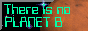
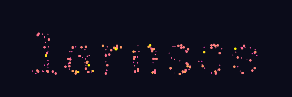
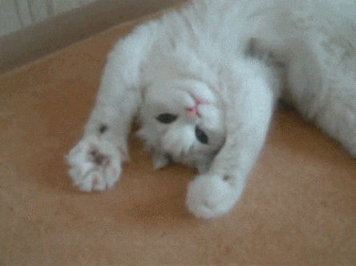

<pre>
                                    ⠀⠀⠀⠀⠀⠀⠀⢀⣴⣿⣿⣦⡀⠀⠀⠀
▌ ▌▗ ▐ ▜▘         ▙ ▌▗       ▜    ▝▌⠀⠀⠀⠀⠀⠀⢀⣾⠿⠛⠛⠿⣷⡀⠀⠀
▙▄▌▄ ▐ ▐  ▝▀▖▛▚▀▖ ▌▌▌▄ ▞▀▖▞▀▖▐ ▞▀▖▝ ⠀⠀⠀⠀⠀⢀⠘⣿⣄⠀⠀⣠⣿⠇⡀⠀
▌ ▌▐ ▝ ▐  ▞▀▌▌▐ ▌ ▌▝▌▐ ▌ ▖▌ ▌▐ ▌ ▌▗▖⠀⠀⠀⠀⣰⡟⣀⣈⣉⣉⣉⣉⣁⣀⢻⣆
▘ ▘▀▘▝ ▀▘ ▝▀▘▘▝ ▘ ▘ ▘▀▘▝▀ ▝▀  ▘▝▀ ▗▘⠀⠀⠀⠀⣿⡇⢸⣿⣿⠿⠿⣿⣿⡇⢸⣿
                                    ⠀⠀⠀⠀⢿⣿⠈⣿⣿⣷⣾⣿⣿⠁⣿⡿
</pre>

A hitchhiker of the cosmos, with a background in computational methods and programming ヽ^^丿[^1]

---

<!-- GUGS_START -->

*Current User: @larnsce | Last update: 2026-04-04T02:34:54.980344*

➡️ *[Want to be up there?](https://github.com/massarin/massarin/issues/new?title=GUGS%20simulation%20request.&body=Use%20my%20github%20username%20as%20initial%20conditions%20to%20an%20n-body%20simulation!)* [^2]

| User | Time |
|------|------------|
| @larnsce | 198d 11h 25m |
| @massarin | 19d 19h 45m |
| @bonschorno | 31m |

<!-- GUGS_END -->

---

<!-- Classic 88x31 button collection -->

 

 

 

*More buttons I like.[^3]*

<!-- font: small block -->
[^1]: *Text to ASCII Art Generator, thanks [patorjk](https://patorjk.com/software/taag/)*

[^2]: *Powered by [GUGS](https://github.com/massarin/gugs)*

[^3]: *Inspired by [88x31 button culture](https://cyber.dabamos.de/88x31/index.html)*

Feel free to explore my repositories and get in touch if you share similar interests or have exciting opportunities to collaborate! 

